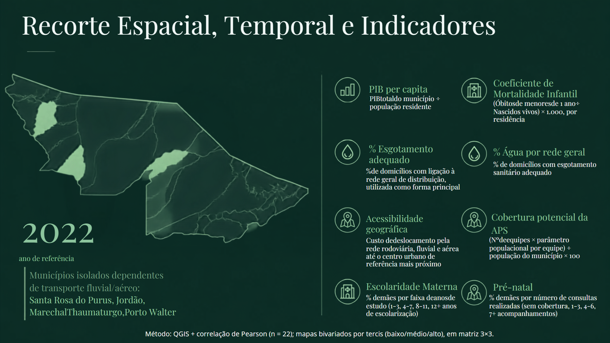

# Mortalidade Infantil no Acre e Seus Condicionantes (2022)
### Análise Espacial e Estatística da Mortalidade Infantil no Acre, Recorte por município - Acre (2022). Uma análise espacial das condições socioeconômicas e do acesso a serviços públicos.

---

## 1. Contextualização e Objetivo
* A investigação da mortalidade infantil no Acre evidencia a dimensão crítica dos determinantes sociais e territoriais da saúde no Brasil. De acordo com o relatório Cenário da Infância e Adolescência no Brasil (Fundação Abrinq, 2026), a Região Norte liderou a taxa de mortalidade infantil em 2024, registrando 15,7 óbitos por mil nascidos vivos, em contraste com a Região Sul, que apresentou o menor indicador do país (10,4 por mil). Diante dessa expressiva disparidade macrorregional, o estado do Acre configura-se como um recorte geográfico estratégico para analisar as correlações e os condicionantes socioespaciais que atuam como agravantes ou fatores de proteção à sobrevida infantil na Amazônia.
* Foram utilizados oito indicadores, construídos a partir de bases públicas do IBGE, do DATASUS e do Ministério da Saúde, integrados em ambiente de Sistema de Informação Geográfica. A análise empregou o coeficiente de correlação de Pearson e a produção de mapas temáticos coropléticos bivariados, cruzando a mortalidade infantil com PIB per capita, acessibilidade geográfica, escolaridade materna e cobertura de pré-natal.
* Para a realização desse projeto utilizei o QGIS para o mapeamento e análises de SIG e PostgreSQL, além do Excel para correções no banco de dados. O plugin utilizado para a geração da legenda bivariada dos mapas foi o "Bivariate legend".
* O presente estudo foi desenvolvido como Projeto Final da disciplina de Sistemas de Informação Geográfica do curso de Pós-graduação em Análise Ambiental e Gestão do Território (ENCE/IBGE), apresentado em formato de monografia. Além disso, o trabalho está em fase final de elaboração para submissão em formato de artigo científico.
* Esse trabalho foi feito em conjunto com o Gabriel Silva (@), colega de classe da pós-graduação da ENCE/IBGE, responsável pelas correlações de Pearson, análise de dados em fontes oficiais e confecção do slide/monografia.
---

## 2. Área de Estudo e Indicadores Selecionados

* 
- Recorte Espacial: Municípios do Estado do Acre
- Recorte Temporal: Ano de referência 2022

* A seleção dos indicadores não foi arbitrária nem determinada exclusivamente pela disponibilidade de dados. Ela se apoia no referencial dos Determinantes Sociais da Saúde (DSS), definidos pela Comissão Nacional sobre os Determinantes Sociais da Saúde (CNDSS) como os fatores sociais, econômicos, culturais, étnicos e raciais, psicológicos e comportamentais que influenciam a ocorrência de problemas de saúde e seus fatores de risco na população (BUSS; PELLEGRINI FILHO, 2007).
* Esse arcabouço orienta diretamente a escolha dos oito indicadores aqui empregados. Revisões da literatura brasileira sobre mortalidade infantil, ao organizarem as variáveis significativamente associadas ao desfecho segundo as camadas do modelo de DSS, identificam de forma consistente a assistência pré-natal e a escolaridade materna na camada de condições de vida e trabalho, e o saneamento básico e a renda na camada de condições socioeconômicas e ambientais gerais.
