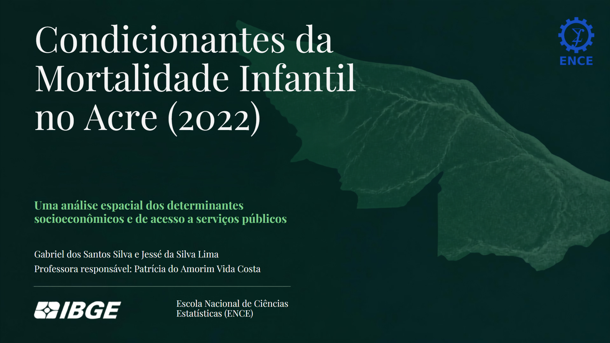
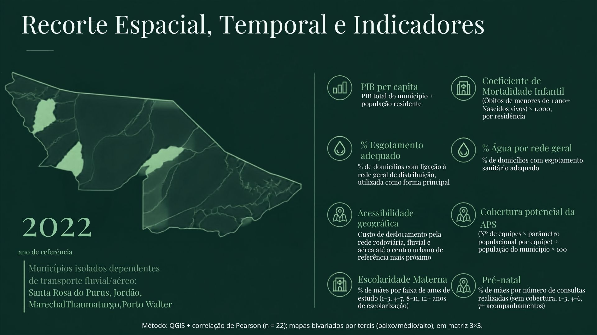
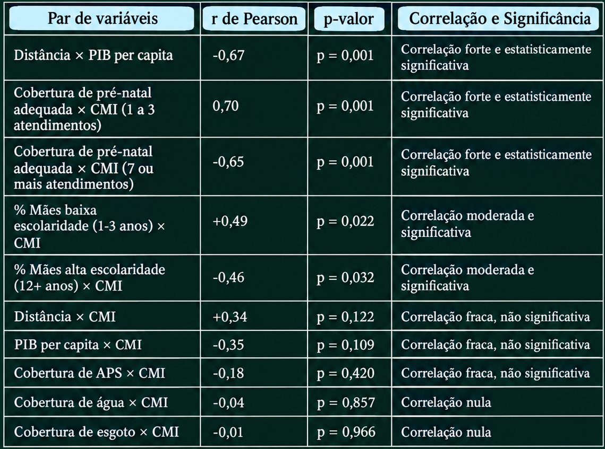
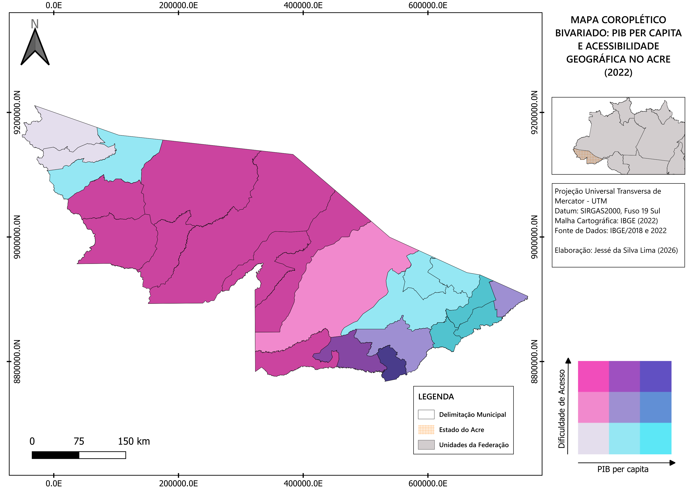
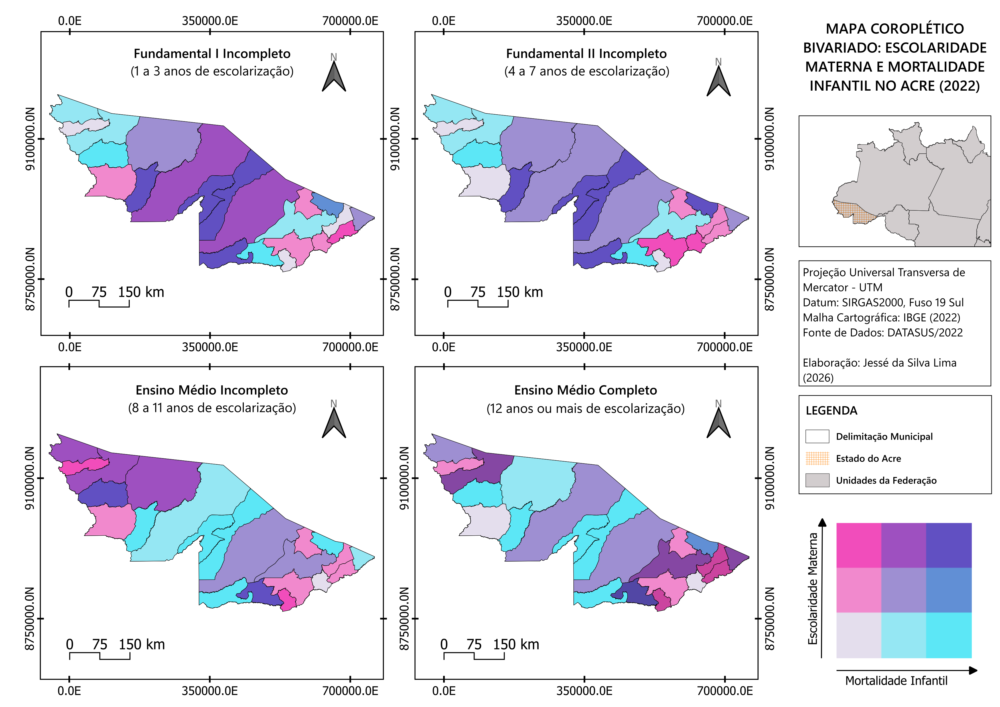
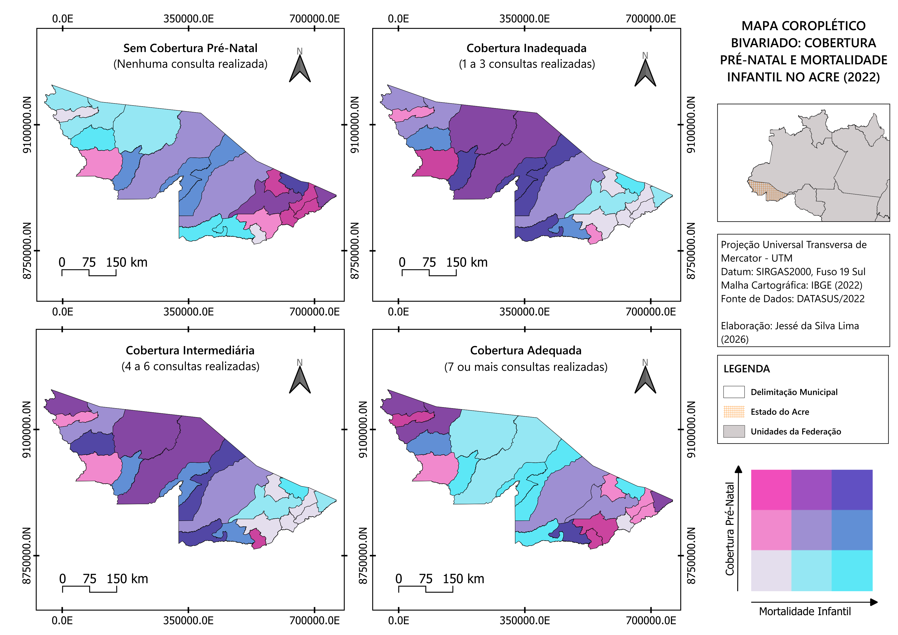

# Mortalidade Infantil no Acre e Seus Condicionantes (2022)
### Análise Espacial e Estatística da Mortalidade Infantil no Acre (2022) - Um estudo das condições socioeconômicas e do acesso a serviços públicos

---

## 1. Contextualização e Objetivo
* A investigação da mortalidade infantil no Acre evidencia a dimensão crítica dos determinantes sociais e territoriais da saúde no Brasil. De acordo com o relatório Cenário da Infância e Adolescência no Brasil (Fundação Abrinq, 2026), a Região Norte liderou a taxa de mortalidade infantil em 2024, registrando 15,7 óbitos por mil nascidos vivos, em contraste com a Região Sul, que apresentou o menor indicador do país (10,4 por mil). Diante dessa expressiva disparidade macrorregional, o estado do Acre configura-se como um recorte geográfico estratégico para analisar as correlações e os condicionantes socioespaciais que atuam como agravantes ou fatores de proteção à sobrevida infantil na Amazônia.
* Foram utilizados oito indicadores, construídos a partir de bases públicas do IBGE, do DATASUS e do Ministério da Saúde, integrados em ambiente de Sistema de Informação Geográfica. A análise empregou o coeficiente de correlação de Pearson e a produção de mapas temáticos coropléticos bivariados, cruzando a mortalidade infantil com PIB per capita, acessibilidade geográfica, escolaridade materna e cobertura de pré-natal.
* Para a realização desse projeto utilizei o QGIS para o mapeamento e análises de SIG e PostgreSQL, além do Excel para correções no banco de dados. O plugin utilizado para a geração da legenda bivariada dos mapas foi o "Bivariate legend".
* O presente estudo foi desenvolvido como Projeto Final da disciplina de Sistemas de Informação Geográfica do curso de Pós-graduação em Análise Ambiental e Gestão do Território (ENCE/IBGE), apresentado em formato de monografia. Além disso, o trabalho está em fase final de elaboração para submissão em formato de artigo científico.
* Esse trabalho foi feito em conjunto com o Geógrafo [Gabriel Silva (@santosgabrielma)](https://www.linkedin.com/in/santosgabrielma/), colega de classe da pós-graduação da ENCE/IBGE, responsável pelas correlações de Pearson, análise de dados em fontes oficiais e confecção do slide/monografia, enquanto a minha pessoa ficou responsável pela confecção e correção do banco de dados (Excel e SQL), além da síntese dos indicadores, análise de dados espaciais e cartografia no QGIS.
---

## 2. Área de Estudo e Indicadores Selecionados

* Recorte Espacial: Munícipios do Estado do Acre.
* Ano de Referência: 2022
* A seleção dos indicadores não foi arbitrária nem determinada exclusivamente pela disponibilidade de dados. Ela se apoia no referencial dos Determinantes Sociais da Saúde (DSS), definidos pela Comissão Nacional sobre os Determinantes Sociais da Saúde (CNDSS) como os fatores sociais, econômicos, culturais, étnicos e raciais, psicológicos e comportamentais que influenciam a ocorrência de problemas de saúde e seus fatores de risco na população (BUSS; PELLEGRINI FILHO, 2007).
* Esse arcabouço orienta diretamente a escolha dos oito indicadores aqui empregados. Revisões da literatura brasileira sobre mortalidade infantil, ao organizarem as variáveis significativamente associadas ao desfecho segundo as camadas do modelo de DSS, identificam de forma consistente a assistência pré-natal e a escolaridade materna na camada de condições de vida e trabalho, e o saneamento básico e a renda na camada de condições socioeconômicas e ambientais gerais.
* Os indicadores utilizados foram:
  - **Coeficiente de Mortalidade Infantil (CMI):** (Óbitos de menores de 1 ano ÷ Nascidos vivos) × 1.000, por residência; Fonte: DATASUS: SIM e SINASC (2022).
  - **PIB per Capita Municipal:** Cobertura de água por rede geral - PIB total do município ÷ população residente; Fonte: IBGE/SIDRA, Censo 2022.
  - **Cobertura de Esgotamento Sanitário Adequado:** % de domicílios com ligação à rede geral de distribuição, utilizada como forma principal; Fonte: Censo IBGE 2022.
  - **Cobertura Potencial da APS:** (Nº de equipes × parâmetro populacional por equipe) ÷ população do município × 100; Fonte: e-Gestor Atenção Básica (dez/2022).
  - **Escolaridade Materna:** (Nº de mães na faixa de escolaridade ÷ Total de mães) × 100; Fonte: DATASUS/SINASC (2022).
  - **Cobertura de Pré-Natal:** (Nº de mães na faixa de consultas ÷ Total de mães com pré-natal registrado) × 100; Fonte: DATASUS/SINASC (2022).
  - **Distância e Classificação de Acessibilidade Geográfica:** Cálculo do custo de deslocamento em minutos pela rede multimodal (rodoviária, fluvial e aérea) até o centro urbano de referência mais próximo na hierarquia REGIC; Fonte: IBGE, Índice de Acessibilidade Geográfica (2018), 'refinado pela equipe'.
---

## 3. Análises Estatísticas

* Para responder à pergunta de pesquisa, foi calculado o coeficiente de correlação de Pearson ($r$) entre pares de variáveis, acompanhado do respectivo p-valor, adotando-se o nível de significância de 5% ($p < 0,05$). O coeficiente de correlação de Pearson consiste em uma medida estatística que indica a força e a direção da relação linear entre duas variáveis quantitativas, representada pelo valor de **r**, que varia de -1 a 1, sendo:
  - **Correlação Positiva ($r > 0$):** As duas variáveis aumentam justas.
  - **Correlação Negativa ($r < 0$):** Quando uma variável aumenta, a outra diminui.
  - **Zero ($r = 0$):** Não existe relação linear entre as variáveis.
  - **Intensidade:** Quanto mais próximo do 1 ou -1, mais forte é a associação.
    
* Este trabalho identificou que a cobertura de pré-natal adequada e a escolaridade materna apresentam associação significativa e mais robusta com a mortalidade infantil do que a capacidade econômica municipal isoladamente. A cobertura de pré-natal adequada, em particular, constitui o segundo achado mais forte de todo o estudo ($r = -0,65; p = 0,001$), superado apenas pela associação
entre distância e PIB per capita.
* Um achado adicional merece destaque: o isolamento geográfico, que explica fortemente a capacidade econômica municipal, não explica de forma robusta o acesso à assistência pré-natal ($r = -0,11$; $p = 0,619$) nem, de forma conclusiva, a escolaridade materna ($r = -0,42$; $p = 0,050$, no limiar da significância). Isso sugere que o acesso à assistência materna no Acre responde a determinantes distintos da simples distância geográfica, possivelmente relacionados à organização e à gestão local dos serviços de saúde.
---

## 4. Bancos de Dados e Análise Espacial

* A organização do banco de dados seguiu quatro etapas:
  - Padronização e tratamento dos dados tabulares;
  - Integração com a base geoespacial municipal;
  - Definição do método de classificação e da simbologia cartográfica;
  - Análise estatística de correlação entre os indicadores.

* Para a análise espacial conjunta dos determinantes de saúde, foram elaborados mapas coropléticos bivariados cruzando a taxa de mortalidade infantil com cinco covariáveis do estudo: PIB per capita, cobertura potencial da Atenção Primária à Saúde, acessibilidade geográfica, escolaridade materna e cobertura de pré-natal. Nessa etapa, cada indicador foi dividido em tercis — baixo, médio e alto —, formando uma legenda em matriz com nove classes de cores (3×3). Portanto, o método utilizado nos mapas bivariados é o dos tercis.
* As tabelas foram consolidadas em uma planilha-mestre única, utilizando o código do município como chave de junção comum a todas as fontes. O resultado é uma tabela de atributos com 22 linhas e uma coluna por indicador, importada e tratada diretamente no QGIS. Por trabalhar com dados brutos, muitas informações estavam em números absolutos, e para evitar erros, diversas correções precisaram ser feita no banco de dados utilizando a Calculadora de Campo nativa do QGIS, em ambiente SQL, para realizar a correção, síntese e a organização dos dados para a confecção dos indicadores e posterior síntese dos mapas. 
* A planilha-mestre foi unida à malha municipal oficial do IBGE para o estado do Acre por meio de junção do código do município, permitindo a espacialização de cada indicador. Os produtos cartográficos foram elaborados na Projeção Universal Transversa de Mercator (UTM), Datum SIRGAS2000, Fuso 19 Sul.
  - A tabela de atributos está disponível para download em: [Tabela de atributos AC(2022).csv](./Tabela%20de%20atributos%20AC(2022).csv)
  - O dicionário de dados está disponível em: [Dicionário de Dados.pdf](./Dicion%C3%A1rio%20de%20Dados.pdf)

---

## 5. Mapas Coropléticos Bivariados:

**Apesar dos diversos indicadores pesquisados e sintetizados, apenas os que apresentaram correlação e significância estatística foram sintetizados**

### 5.1 PIB per capita e Acessibilidade Geográfica

* Os achados revelam dois eixos explicativos independentes para a mortalidade infantil no Acre: o territorial-econômico e o de assistência materna. Enquanto o isolamento geográfico condiciona fortemente a capacidade econômica municipal ($r = -0,67$; $p = 0,001$), se opondo ao leste acessível e de maior PIB ao oeste remoto de menor PIB, ele não explica diretamente o desfecho em saúde. Por outro lado, a cobertura de pré-natal e a escolaridade materna explicam a mortalidade infantil de forma robusta e direta, demonstrando que os determinantes da assistência à saúde gestacional seguem uma lógica territorial autônoma em relação à distância física aos polos urbanos.
  - Diferente dos mapas a seguir, esse se apresentou mais homogêneo por predominar a presença de cores do extremo eixo X ou Y, evidenciando visualmente o achado estatístico.

### 5.2 CMI e Escolaridade Materna

* Há  uma nítida inversão de polaridade no coeficiente de Pearson ($r$): enquanto a baixa escolaridade (1 a 3 anos de estudo) apresenta uma correlação positiva moderada com o CMI ($r = +0,49$; $p = 0,022$), indicando que a menor instrução agrava as taxas de óbito infantil, a alta escolaridade ($\ge 12$ anos) exibe uma correlação negativa ($r = -0,46$; $p = 0,032$), demonstrando um efeito protetivo em que a maior instrução materna se associa diretamente à redução da mortalidade infantil no território.

### 5.3 CMI e Cobertura Pré-Natal

* Enquanto a cobertura inadequada (1 a 3 atendimentos) exibiu a maior correlação positiva de todo o estudo ($r = +0,70$; $p = 0,001$), demonstrando que a insuficiência de consultas eleva diretamente o risco de óbito infantil, a cobertura adequada (7 ou mais atendimentos) apresentou uma forte correlação negativa ($r = -0,65$; $p = 0,001$), confirmando que a assistência gestacional completa exerce um poderoso efeito protetivo na redução da mortalidade no território.
  - **Achado relevante:** a cobertura de pré-natal adequada e a escolaridade materna correlacionam-se fortemente entre si (r = 0,63; p = 0,002), sugerindo que ambas compartilham determinantes comuns, possivelmente relacionados ao capital social e informacional das famílias.

---

## 6. Conclusão

* Conclui-se que a Mortalidade Infantil no Acre deve ser analisada de forma multidimensional, não sendo possível afirmar que apenas um indicador é o suficiente para evidenciar o aumento ou diminuição do CMI. Os resultados encontrados demonstraram que a cobertura pré-natal adequada (sete acompanhamentos ou mais realizados) e mães que completaram o ensino médio (doze anos ou mais de educação) apresentaram associação significativa ao CMI. A cobertura de pré-natal adequada, em particular, constitui o segundo achado mais forte de todo o estudo (r = -0,65; p = 0,001), superado apenas pela associação entre distância e PIB per capita.
* A principal contribuição deste trabalho é, portanto, dupla. Por um lado, confirma que a organização territorial e a acessibilidade aos centros urbanos de referência constituem uma dimensão relevante para compreender as desigualdades econômicas no Acre. Por outro, revela que os determinantes mais diretamente ligados à assistência à saúde materna, cobertura de pré-natal e escolaridade, explicam a mortalidade infantil de forma mais robusta do que a capacidade econômica municipal, e que esses determinantes seguem uma lógica relativamente independente da distância geográfica.
  - Como principais limitações, destacam-se: o tamanho reduzido da amostra (n = 22 municípios), que restringe o poder estatístico dos testes de correlação; a ausência de dados formais de saneamento para a maior parte dos municípios no SNIS, que exigiu a substituição por dados censitários de metodologia distinta; a natureza do indicador de cobertura de APS, que mede capacidade instalada e não atendimento efetivo; e a natureza transversal e ecológica da análise, que não permite inferências causais nem individuais.
  - Como agenda para pesquisas futuras, sugere-se a ampliação da série temporal para análise longitudinal, a investigação dos fatores de gestão municipal e organização local dos serviços de saúde que possam explicar a cobertura de pré-natal de forma mais direta do que a distância geográfica, e a aplicação de modelos de regressão múltipla que permitam controlar simultaneamente o efeito de todas as variáveis analisadas.

---

## 7. Bibliografia

* Para quem quiser se aprofundar na temática, disponibilizo a bibliografia utilizada para a confecção desse trabalho.

### **Obrigado!**
